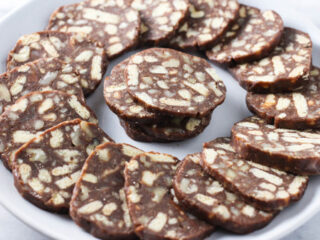

# Chocolate Kielbasa

A fantastic sweet dessert in the style of a log of salami, but made out of chocolate!

- Biscuits
- Chopped Walnuts
- Butter
- Milk
- Sugar
- Cocoa Powder
- Parchment Paper or Aluminum Foil

1. Break half of the biscuits into smaller pieces
2. Grind the second half of the biscuits into crumbs
3. Melt butter with milk, sugar, and cocoa powder
4. Mix wet ingredients with dry ingredients (chopped biscuits, crumbs, and chopped walnuts)
5. Split mixture into three parts and place them onto aluminum foil or parchment paper
6. Form into logs and seal the ends
7. Freeze until firm
8. Slice into thin slices and serve